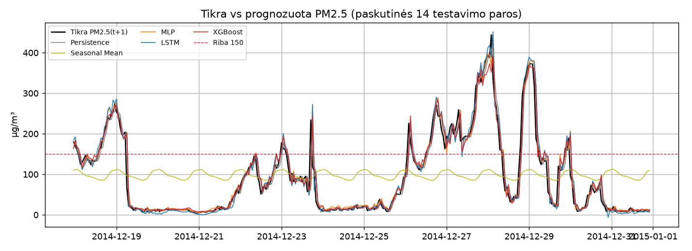
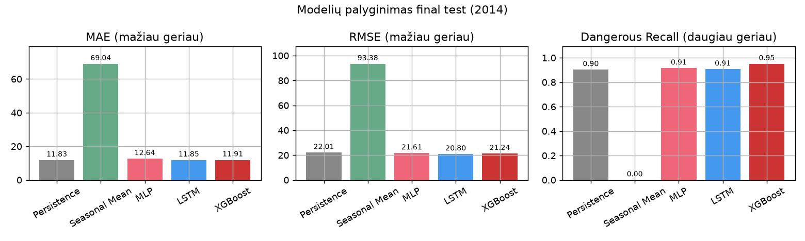
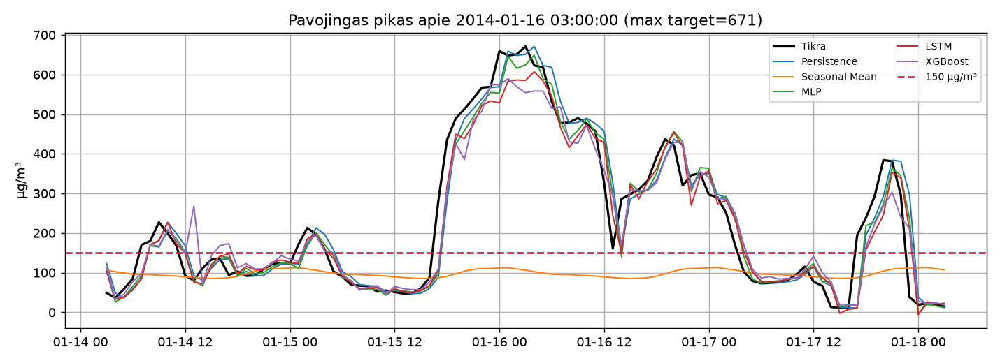

# Pekino PM2.5 valandinė prognozė

Projektas prognozuoja **kitos valandos** PM2.5 koncentraciją (`PM2.5(t+1)`) pagal UCI *Beijing PM2.5 Data* rinkinį. Viename Jupyter notebook faile: duomenų paruošimas, baseline metodai (Persistence, Seasonal Mean), MLP, LSTM, XGBoost, chronologinis rolling-origin vertinimas, abliacija, atsparumo eksperimentas, grafikai, išvados ir AI naudojimo žurnalas.

## Python versija

Paruošta ir patikrinta su **Python 3.13.2** (64 bitų, Windows). Turėtų veikti ir su Python 3.11–3.13.

## Virtualios aplinkos sukūrimas ir aktyvavimas

**Windows PowerShell:**
```powershell
python -m venv pm25_egz_env
.\pm25_egz_env\Scripts\Activate.ps1
```

**Windows cmd:**
```bat
python -m venv pm25_egz_env
pm25_egz_env\Scripts\activate.bat
```

**Linux / macOS:**
```bash
python3 -m venv pm25_egz_env
source pm25_egz_env/bin/activate
```

**Windows ir ilgi keliai.** Jei `pip` skundžiasi *Windows Long Path* (dažniausiai diegiant `torch`), sukurkite venv trumpame kelyje ir projekte palikite junction (pakeiskite kelią į savo):
```powershell
python -m venv C:\venvs\pm25_egz_env
cmd /c mklink /J pm25_egz_env C:\venvs\pm25_egz_env
.\pm25_egz_env\Scripts\Activate.ps1
```

## Priklausomybių įdiegimas

```powershell
python -m pip install -r requirements.txt
```

Jei `torch` diegimas iš `requirements.txt` nepavyksta, įdiekite CPU versiją atskirai:
```powershell
python -m pip install torch --index-url https://download.pytorch.org/whl/cpu
python -m pip install -r requirements.txt
```

`requirements.txt` sąmoningai neįtraukia `jupyter`/JupyterLab meta-paketo (Windows su ilgu projekto keliu diegimas dažnai nutrūksta) — notebook paleidimui iš IDE užtenka `ipykernel` ir `nbconvert`.

## Duomenų atsisiuntimas

Duomenys turi būti: `data/PRSA_data_2010.1.1-2014.12.31.csv`

Jei failo nėra, atsisiųskite UCI rinkinį ir išarchyvuokite CSV į `data/`:
- https://archive.ics.uci.edu/dataset/381/beijing+pm2+5+data
- tiesioginis zip: https://archive.ics.uci.edu/static/public/381/beijing+pm2+5+data.zip

## Notebook paleidimas

Aktyvavus `pm25_egz_env`, atidarykite `PM25_prognozavimas.ipynb` (VS Code / JupyterLab) ir paleiskite visas ląsteles (**Run All**). Branduolį rinkitės iš `pm25_egz_env`.

Kernelio registravimas (jei IDE aplinkos nematytų):
```powershell
python -m ipykernel install --user --name pm25_egz_env --display-name "Python (pm25_egz_env)"
```

## Viena komanda pagrindiniam eksperimentui pakartoti

Iš projekto šaknies, su aktyviu `pm25_egz_env`:
```powershell
python run_experiment.py
```
Skriptas įvykdo visą `PM25_prognozavimas.ipynb` (timeout 2 val.). Rezultatai įrašomi į `results/` ir `figures/`, notebook išsaugomas su išvestimi.

## Projekto struktūra

```
Egzaminas/
├── PM25_prognozavimas.ipynb   # visa analizė (vienintelis notebook)
├── run_experiment.py          # vienos komandos paleidimas
├── requirements.txt
├── README.md
├── pm25_egz_env/              # virtuali aplinka (sukuriama vietoje)
├── data/
│   └── PRSA_data_2010.1.1-2014.12.31.csv
├── figures/                   # grafikai (sukuria notebook)
└── results/                   # rezultatų lentelės CSV (sukuria notebook)
```

## Metodai, vertinimo protokolas ir metrikos

**Metodai:** Persistence (last value), Seasonal Mean (tos pačios valandos istorinis vidurkis), MLP, LSTM, XGBoost.

**Skaidymas — chronologinis, be atsitiktinio `train_test_split`:**
- Train: 2010–2012 · Val: 2013 (tik hiperparametrams rinktis) · Test: 2014 (galutinis, hiperparametrams niekada nenaudojamas).
- Test viduje — rolling-origin (walk-forward) vertinimas: 4 origin taškai (kas ketvirtį 2014 m.), kiekviename modelis pertreniruojamas tik iš iki tol turimos istorijos (expanding window).

**Metrikos** (visiems metodams vienodos): MAE, RMSE, Dangerous Level Recall = `TP / (TP + FN)`, riba **τ = 150 µg/m³** (Kinijos AQI „sunkiai užteršta" 24h riba, pritaikyta valandiniams duomenims).

**Fiksuotos atsitiktinės sėklos:** `RANDOM_SEED = 42` naudojamas visur (NumPy, PyTorch, scikit-learn, XGBoost), kad rezultatai būtų atkuriami.

**Papildomi eksperimentai notebook viduje:**
- Abliacija (XGBoost, požymių grupės: pilnas / be meteo / be lag'ų / be laiko požymių) — 11 sekcija, `results/ablation_xgb.csv`.
- Atsparumo testas (papildomai pašalinta 15 % reikšmių) — 12 sekcija, `results/robustness_extra_missing.csv`.

## Rezultatai (final test, 2014 m.)

| Metodas | MAE | RMSE | Dangerous Recall | TP | FN |
|---|---|---|---|---|---|
| Persistence | 11.8251 | 22.0123 | 0.9027 | 1614 | 174 |
| Seasonal Mean | 69.0366 | 93.3809 | 0.0000 | 0 | 1788 |
| MLP | 12.6364 | 21.6081 | 0.9150 | 1636 | 152 |
| LSTM | 11.8491 | 20.8000 | 0.9066 | 1621 | 167 |
| **XGBoost** | **11.4745** | 21.3730 | 0.8982 | 1606 | 182 |

*(1788 pavojingų valandų iš 8759 test valandų viso; pilna lentelė — `results/final_test_metrics.csv`)*

**Trumpa interpretacija:**
- **XGBoost** turi mažiausią MAE, bet skirtumas nuo Persistence (11.83) ir LSTM (11.85) statistiškai nereikšmingas (<1 %) — prie 1h horizonto PM2.5 stipriai autokoreliuotas, tad „paskutinė reikšmė" yra sunkiai aplenkiamas baseline'as.
- **MLP** turi geriausią Dangerous Recall (0.915) — geriausiai pagauna pavojingus pikus.
- **Seasonal Mean** (tos pačios valandos istorinis vidurkis) aiškiai silpniausias ir niekada neviršija 150 µg/m³ ribos (Recall=0) — tai tikėtinas, o ne klaidingas rezultatas: metodas ignoruoja einamąją būseną, todėl neaptinka staigių taršos epizodų.

**Grafikai** (generuojami notebook 13 sekcijoje, `figures/`):







Didelių klaidų pavyzdžiai (top‑12 kiekvienam metodui) — `results/large_errors_<Metodas>.csv`.
